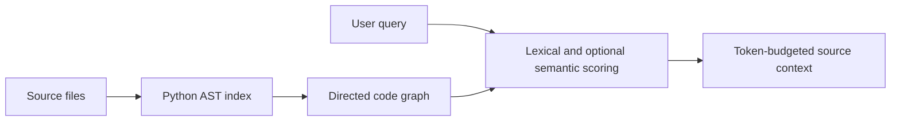

# ContextGraph

[](https://github.com/yniantongtian-oss/contextgraph/actions/workflows/ci.yml)
[](LICENSE)
[](https://www.python.org/)

**Python-first code graph retrieval for focused LLM and coding-agent context.**

ContextGraph scans a repository, extracts Python files, classes, functions, methods, imports, and resolvable call relationships, then ranks source snippets against a query under an approximate token budget.

> Project status: early alpha. The public API and graph schema may change before 1.0.

## What works today

- Python AST indexing for files, classes, functions, methods, imports, and local call edges
- Hybrid ranking using symbol names, file paths, source text, graph degree, and optional local embeddings
- Token-budgeted source-context output
- CLI commands for scanning, querying, and prompt generation
- A small Python API with no required cloud service
- CI across Python 3.10 through 3.13

## Installation

Install the current development version from GitHub:

```bash
python -m pip install "git+https://github.com/yniantongtian-oss/contextgraph.git"
```

The planned PyPI distribution name is `contextgraph-ai` because the `contextgraph` distribution name is already used by an unrelated project. After the first release:

```bash
python -m pip install contextgraph-ai
```

Optional semantic retrieval:

```bash
python -m pip install "contextgraph-ai[semantic]"
```

The distribution name is `contextgraph-ai`; the Python import remains:

```python
from contextgraph import CodeContextGraph
```

## CLI quick start

Scan a Python project:

```bash
contextgraph scan ./my-project
```

Retrieve context without downloading an embedding model:

```bash
contextgraph query "authentication token validation" \
  --project ./my-project \
  --budget 1200
```

Use optional local semantic retrieval:

```bash
contextgraph query "where is user identity verified" \
  --project ./my-project \
  --budget 1200 \
  --semantic
```

Generate a prompt containing the retrieved source:

```bash
contextgraph prompt "Add rate limiting to login" \
  --project ./my-project \
  --max-tokens 1600
```

## Python API

```python
from contextgraph import CodeContextGraph

cg = CodeContextGraph()
cg.load_project("./my-project")
cg.build_graph()

result = cg.query_context(
    "authentication token validation",
    max_tokens=1200,
)

print(result["context"])
print(result["relevant_files"])
print(result["scores"])
```

## How it works



The graph uses stable repository-relative identifiers such as:

- `file:src/service.py`
- `symbol:src/service.py::UserService.login`
- `module:sqlite3`

Call edges are resolved when a target symbol can be identified unambiguously. Dynamic dispatch, runtime imports, decorators, and reflection are not fully modeled.

## Development

```bash
git clone https://github.com/yniantongtian-oss/contextgraph.git
cd contextgraph
python -m pip install -e ".[dev]"
ruff check src tests examples
ruff format --check src tests examples
pytest --cov=contextgraph
python -m build
```

See [CONTRIBUTING.md](CONTRIBUTING.md) and [docs/architecture.md](docs/architecture.md) for repository conventions and design details.

## Roadmap

- Persistent graph snapshots and incremental indexing
- Better import and cross-file call resolution
- Tree-sitter parsers for TypeScript, JavaScript, C, and C++
- Context expansion through callers, callees, and neighboring symbols
- Reproducible retrieval benchmarks
- MCP and editor integrations

## Security

ContextGraph reads local source files. Review [SECURITY.md](SECURITY.md) before using it on untrusted repositories or enabling optional model downloads.

## License

MIT. See [LICENSE](LICENSE).
